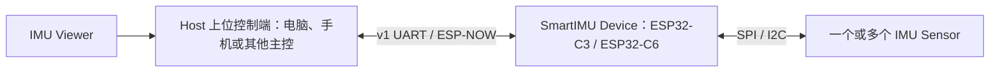
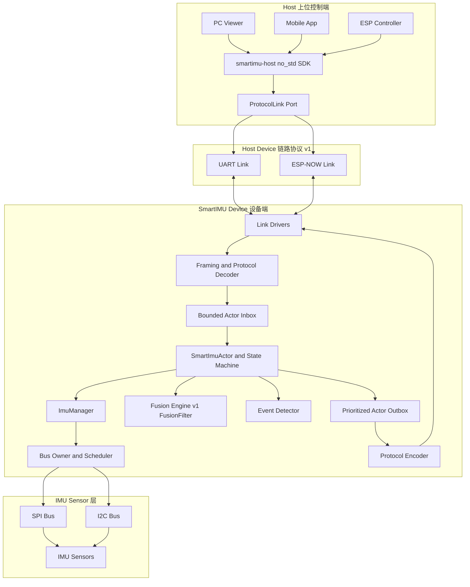
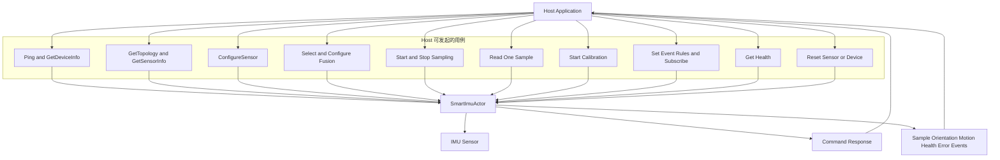
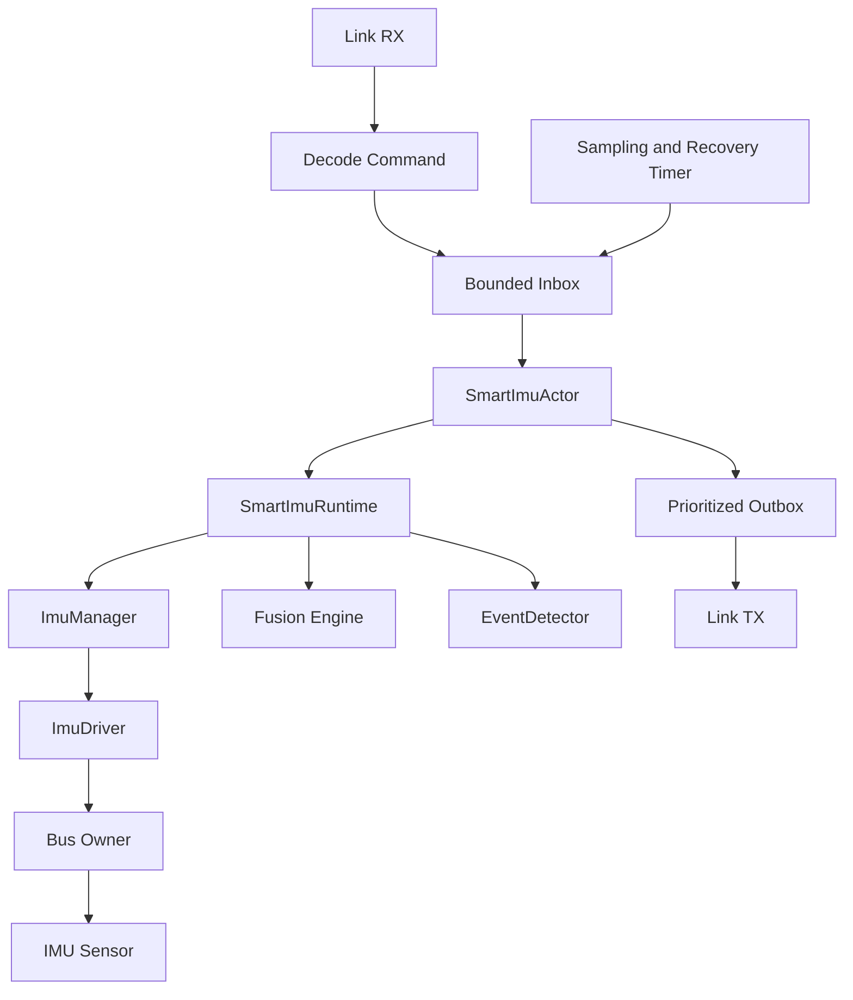
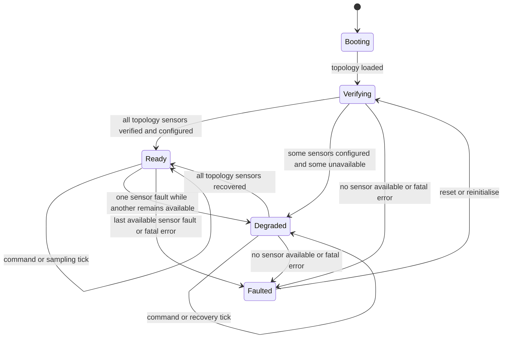
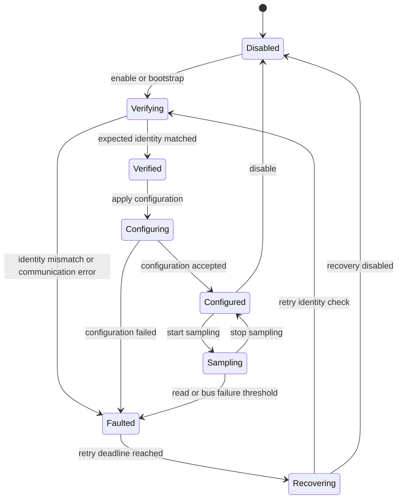
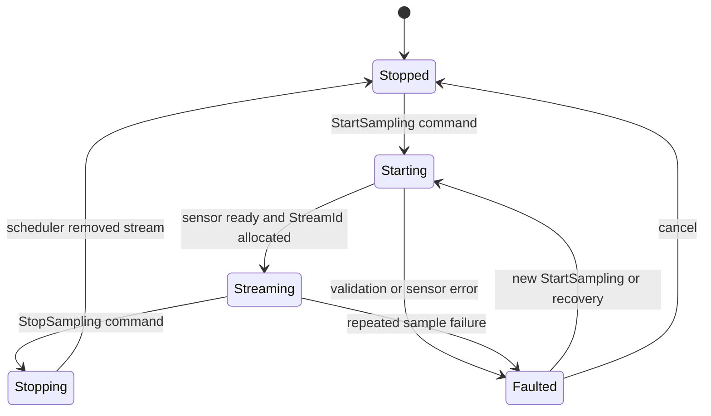
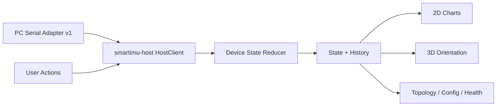

# SmartIMU 项目架构草案

> 状态：Draft
>
> 本文只描述目标架构，后续由讨论结果继续修改。

## 审查导航

建议按以下顺序审查：

1. 第 1～3 节：角色、部署形态和总体组件架构。
2. 第 4 节：Host 用例与关键交互时序。
3. 第 5 节：Actor、Sensor 和 Sampling Stream 状态机。
4. 第 6 节：application protocol、link protocol 与平台 backend。
5. 第 7～15 节：Workspace、总线、driver、Link Manager、并发、Viewer、feature 和测试边界。
6. 第 16 节及 [data-model.md](data-model.md)：核心领域数据结构审查。
7. [protocol.md](protocol.md)：Host/Device 协议、wire code、Link framing 与 HostClient 审查。
8. 第 17 节：仍需确认的架构决策。

## 1. 项目定义

SmartIMU 是一个运行在 ESP 系列芯片上的智能 IMU 系统。

系统由三类角色组成：

1. **上位控制端（Host）**
   - 可以是电脑、手机/平板，也可以是其他主控板。
   - 向 SmartIMU Device 发送命令。
   - 接收 Device 响应、IMU 数据和主动事件。
   - 电脑形态的 Host 提供 Viewer，用于观察 IMU 数据与姿态响应。

2. **SmartIMU 设备端（Device）**
   - 本项目固件所在的 ESP 单片机及其外围，例如 ESP32-C3、ESP32-C6。
   - 管理 IMU Sensor、融合算法、事件检测和通信链路。
   - 响应 Host 命令，也可以主动向 Host 上报事件。

3. **IMU 传感器（Sensor / IMU Sensor）**
   - 一个或多个具体 IMU 芯片。
   - 通过 SPI 或 I²C 与 SmartIMU Device 连接。

本文后续统一使用 `Host`、`Device` 和 `Sensor` 作为架构与代码命名，对应中文为“上位控制端”、“SmartIMU 设备端”和“IMU 传感器”。



## 2. 需要兼容的部署形态

### 2.1 开发测试形态

开发阶段使用一个 5 IMU 测试板：

- 硬件定义以 `docs/hardware.md` 为准。
- 一个 ESP 同时管理 5 个不同 IMU。
- 用于验证：
  - 不同已知 IMU 型号的身份验证与初始化。
  - 精度、噪声、漂移和动态响应。
  - 不同量程、采样率与滤波配置。
  - 多 IMU 同时采样与姿态对比。
  - SPI profile、片选和共享总线调度。
  - 通信带宽与 Viewer 多传感器展示能力。

### 2.2 生产部署形态

生产阶段通常只有一个指定 IMU 直连 ESP：

- 只启用实际使用的 IMU 驱动。
- 只配置一个传感器实例。
- 可以使用 SPI，也可以使用 I²C。
- v1 只实现 UART 和 ESP-NOW；BLE/Wi-Fi 等到出现具体产品需求后再扩展。
- 不为开发板中的其他 IMU 支付不必要的固件体积和运行时开销。

### 2.3 统一原则

开发板与生产板不使用两套业务架构。

两者都由同一个 `DeviceTopology` 描述：

```text
DeviceTopology
  ├─ buses[]
  └─ sensors[]
       ├─ sensor_id
       ├─ model
       ├─ bus_binding
       ├─ default_config
       └─ axis_mapping
```

差别仅是静态配置：

| 场景 | Bus | Sensor |
|---|---:|---:|
| 5 IMU 开发板 | 通常 1 条共享 SPI，也允许扩展 | 5 |
| 生产设备 | 1 条 SPI 或 I²C | 1 |

运行时只遍历拓扑，不编写 `development_mode` 和 `production_mode` 两套分支。

## 3. 总体分层



依赖方向：

```text
应用与平台层
    ↓
运行时与协议层
    ↓
领域、驱动、融合与总线抽象
```

底层共享代码不反向依赖 ESP32-C3、ESP32-C6 或 Viewer。

SmartIMU application protocol 只有一套。v1 只实现 UART 和 ESP-NOW，两者复用同一个 Rust `smartimu-host` 和业务消息；平台差异只在最薄的串口或 ESP-NOW I/O backend。BLE/Wi-Fi 以及手机平台接入保留为后续方向，不提前设计其 framing、negotiation 或 capability model。

## 4. Host 用例与交互

### 4.1 用例图



用例分为两类结果：

- Command 必须得到关联同一 `RequestId` 的 Response。
- Sampling、状态变化和智能检测通过独立 Event 持续或主动上报。

### 4.2 普通 Sensor Command 交互

```mermaid
sequenceDiagram
    participant App as Host App
    participant Client as smartimu-host
    participant Link as UART or ESP-NOW
    participant Codec as Device Codec
    participant Actor as SmartImuActor
    participant Manager as ImuManager
    participant Bus as Bus Owner
    participant Sensor as IMU Sensor

    App->>Client: configure sensor
    Client->>Client: allocate RequestId
    Client->>Link: encode Command
    Link->>Codec: receive frame or datagram
    Codec->>Actor: HostCommand LinkId Command
    Actor->>Actor: validate Device and Sensor state
    Actor->>Manager: configure Sensor
    Manager->>Bus: atomic target transaction
    Bus->>Sensor: SPI or I2C registers
    Sensor-->>Bus: result
    Bus-->>Manager: domain result
    Manager-->>Actor: effective configuration
    Actor->>Actor: Configuring to Configured
    Actor-->>Codec: Reply LinkId Response
    Codec-->>Link: encoded Response
    Link-->>Client: Response in_reply_to RequestId
    Client-->>App: completed result
```

无论成功或失败，Actor 都创建结构化 Response，并通过原始 `LinkId` 返回请求来源。

### 4.3 StartSampling 与持续 Event

```mermaid
sequenceDiagram
    participant Host as smartimu-host
    participant Link
    participant Actor as SmartImuActor
    participant Runtime as SmartImuRuntime
    participant Sensor as IMU Sensor
    participant Fusion as Fusion Engine
    participant Detector as EventDetector

    Host->>Link: StartSampling RequestId
    Link->>Actor: HostCommand LinkId Command
    Actor->>Runtime: validate target and config
    Actor->>Actor: stream Stopped to Starting
    Runtime->>Sensor: configure and verify ready
    Sensor-->>Runtime: ready
    Actor->>Actor: allocate StreamId and enter Streaming
    Actor-->>Link: Response StreamId effective config revision
    Link-->>Host: Response in_reply_to RequestId

    loop SamplingTick while Streaming
        Actor->>Runtime: SamplingTick
        Runtime->>Sensor: read sample through bus owner
        Sensor-->>Runtime: RawImuSample
        Runtime->>Fusion: PhysicalImuSample and dt
        Fusion-->>Runtime: Quaternion
        Runtime->>Detector: sample and orientation
        Runtime-->>Actor: sample orientation and optional smart event
        Actor-->>Link: subscribed DeviceEvent
        Link-->>Host: SampleBatch Orientation or smart event
    end
```

### 4.4 Device 主动智能事件

```mermaid
sequenceDiagram
    participant Timer
    participant Actor as SmartImuActor
    participant Runtime as SmartImuRuntime
    participant Fusion as Fusion Engine
    participant Detector as EventDetector
    participant Links as Link Manager
    participant Host as subscribed Hosts

    Timer->>Actor: SamplingTick
    Actor->>Runtime: sample active Sensors
    Runtime->>Fusion: calibrated physical sample
    Fusion-->>Runtime: orientation
    Runtime->>Detector: orientation and motion state
    Detector-->>Runtime: AttitudeChanged or SignificantMotion
    Runtime-->>Actor: DeviceEvent
    Actor->>Links: Publish Event
    Links->>Links: select subscribed LinkIds
    Links-->>Host: encoded Event
```

智能事件不伪装成某个 Command 的 Response。采样类 Event 使用 `{ BootSessionId, StreamId, SampleIndex }` 和 source `SensorId` 识别生命周期与顺序；Link 的分片、重传和丢包序号由每条 Link/peer 独立管理。非采样 Event 只有在未来需要可靠缺失检测时才引入有明确作用域的 `EventSeq`。

## 5. SmartImuActor 与 Device 状态机

`SmartImuActor` 是 Device 业务核心。Link RX、timer 和其他任务只向 bounded inbox 投递 `ActorMessage`；只有 Actor 可以修改 `SmartImuRuntime`、驱动 Sensor 状态转换、创建 Response/Event 和控制 `ImuManager`。



架构图只表示 Actor 拥有状态机和组件关系；完整状态转换使用独立状态机图表达。交互时序图会标出哪些 Command/Event 触发状态变化，不在一张组件图中塞入所有转换。

### 5.1 Device Actor 状态机



- `Verifying`：按 topology 已知的 `ImuChipModel -> 唯一 Driver` 映射验证 WHO_AM_I/revision，并应用默认配置；不是动态 discovery。
- `Ready`：topology 中的所有 Sensor 可用。
- `Degraded`：至少一个 Sensor 可用、至少一个不可用，Device 仍能提供部分服务。
- `Faulted`：没有任何 Sensor 可用，或发生无法继续服务的 fatal error。
- Link 断开不会自动让 Device 进入 `Degraded`，只清理该 Link 的 pending subscription。

### 5.2 Sensor 生命周期状态机

初始化阶段使用 `ImuDevice<Verified/Configured>` typestate，同时由 Actor 管理动态生命周期：



`Verified -> Configured` 保证 API 初始化顺序；`Disabled/Faulted/Recovering` 表达运行时现实。不能用一个 `Option` 同时表示未验证、禁用、通信失败和配置失败。

每个 Sensor runtime 保存：

- `sensor_id`、`bus_binding` 和 matched driver。
- lifecycle 与 sampling stream state。
- 生效配置、capability 和 revision。
- sample index、stream ID 和时间戳。
- calibration、Board axis mapping 和 v1 `FusionFilter` instance。
- EventDetector、最近错误和恢复 deadline。

### 5.3 Sampling Stream 状态机



StartSampling Response 只在进入 `Streaming` 后返回成功，并携带包含 `StreamId`、`SensorId`、effective config 和输出类型的 Stream descriptor。v1 不允许在同一 Stream 内热修改采样或 Fusion 配置；配置变化必须结束旧 Stream 并分配新的 `StreamId`。`ConfigRevision`/`FusionRevision` 留作后续热配置扩展。

### 5.4 数据处理管线与 Fusion

```text
Raw register data
  -> RawImuSample
  -> Scale to Sensor-frame physical units
  -> Calibration in Sensor frame
  -> Axis mapping to Board frame
  -> PhysicalImuSample
  -> FusionConfig selected Fusion Engine
  -> OrientationPayload
  -> EventDetector
  -> DeviceEvent
```

`RawImuSample`、`PhysicalImuSample` 和 `Quaternion` 分型避免单位混用。每个 Sensor 独立持有 Fusion state，并由相邻 sample acquisition timestamp 计算 `dt`。v1 的时间戳在 sample/read pipeline 中取 ESP 单调时钟，不使用 Event 编码或发送时间；当前 Driver 未读取 IMU 芯片内部 timestamp。

v1 直接复用已有 `FusionFilter` 作为 6-axis AHRS。协议用单一 `FusionConfig::Ahrs6Axis(FusionFilterSettings)` 绑定算法与设置，不提前建立动态 registry/trait object。第二种算法真正实现时再增加 `FusionConfig` variant 和内部 static-dispatch engine。设置变化必须结束旧 Stream、reset 新实例并分配新的 `StreamId`；只有后续支持 Stream 内热切换时才启用 `FusionRevision`。

### 5.5 Calibration 边界

`calibration/` 包含四类职责：

```text
calibration/
  ├─ model        bias、correction matrix、source、revision、quality
  ├─ apply        对 PhysicalImuSample 应用校准参数
  ├─ procedure    静止零偏、六面体等校准流程状态机
  └─ persistence 校准数据编码/校验；实际 flash I/O 由平台 storage port 实现
```

边界规则：

- Driver 只负责芯片寄存器和 raw-to-physical scale，不持有用户校准。
- `AxisMapping` 属于 Board topology/frame 定义，不属于 calibration。
- calibration 在 Sensor frame 中应用，之后再映射到 Board frame。
- 每个 Sensor 可以组合 Factory、Board 和 User calibration layer，并产生最终 effective calibration。
- calibration 更新递增 revision，并产生 `CalibrationChanged` Event。
- flash/NVS 等存储实现放在 `smartimu-esp`，core 只定义存储 port 和可校验的数据格式。

### 5.6 智能事件

除连续采样外，Actor 可以主动产生事件，例如：

- 姿态变化超过阈值。
- 显著运动。
- 静止开始/结束。
- 跌落或冲击。
- Sensor 离线或恢复。
- calibration 或 Fusion 配置变化。
- 温度、采样率或通信异常。

事件检测规则由 runtime/detector 管理，不写入具体 IMU driver。

## 6. Host 与 SmartIMU Device 通信

### 6.1 链路与协议分离

SmartIMU application protocol 定义统一的 Command、Response 和 Event。v1 只提供两个承载：

```text
Application Message
  Command / Response / Event / SampleBatch

Stable Binary Envelope
  magic / wire version / message kind / payload length

v1 Link Framing
  UART: postcard payload + CRC32 + COBS + 0 delimiter
  ESP-NOW: one encoded message per datagram
```

协议消息本身不依赖 UART 或 ESP-NOW。现有 `protocol.rs` 的业务 message/payload、`ResponseResult` 和错误码继续复用；现有 postcard + CRC32 + COBS 编解码迁到 UART adapter。v1 不建立通用 packet/fragmentation layer；每条 encoded message 必须适配目标 Link 的编译期大小上限，超限返回 `MessageTooLarge`。

### 6.2 链路协议与平台 I/O backend

v1 共享层只保留最小 Link port，具体 framing 分别由 UART 和 ESP-NOW adapter 完成：

| Link protocol | v1 逻辑 | 平台 I/O backend 示例 |
|---|---|---|
| UART | COBS、CRC、字节流重同步 | PC serial、USB serial、ESP UART |
| ESP-NOW | 一条 application message 对应一个 datagram；超限报错 | ESP backend |

```rust
pub trait ProtocolLink {
    fn send(&mut self, message: &[u8]) -> Result<(), LinkError>;
    fn receive(&mut self, output: &mut [u8]) -> Result<Option<usize>, LinkError>;
}
```

不定义 `LinkCapabilities`、delivery/ordering negotiation 或通用 fragmentation state machine。实际 async 签名可以由平台适配，但语义保持一致。

Binary 协议作为正式链路。JSON/NDJSON 可以保留为 UART 开发诊断模式，但不产生第二套业务语义。

### 6.3 Application protocol 边界

协议在架构层只暴露三类业务消息：

```text
Host Link -> decoded Command -> SmartImuActor
SmartImuActor -> DeviceResponse -> original LinkId
SmartImuActor -> DeviceEvent -> Link Manager publish
```

关键边界：

- Command/Response 使用 `RequestId/in_reply_to` 关联，不定义 `ResponseId`。
- sample 顺序使用 `{ BootSessionId, SensorId, StreamId, SampleIndex }`，不定义 Device 全局 `MessageSeq`。
- `LinkId` 只用于 Device 内部回程路由，不进入 wire。
- sample timestamp 表示采样时刻，不表示 Event 编码或发送时间。
- UART 与 ESP-NOW 共享 application payload，但使用不同 framing；v1 不做通用分片。
- 当前硬件没有 power telemetry backend，因此 Power Command/Event 不进入 v1。

Command 列表、显式稳定 wire code、Response/Event payload、错误码、HostClient、兼容规则、UART COBS/CRC 和 ESP-NOW datagram 设计统一放在 [protocol.md](protocol.md)，不在宏观架构中重复维护。

## 7. 建议的 Workspace 结构

为了兼顾边界清晰和不过度拆分，建议使用 3 个共享 crate、Device/Host 两种嵌入式应用角色，以及按平台实现的 Host 应用：

```text
.
├─ crates/
│  ├─ smartimu/                 平台无关、no_std 协议与 Device/IMU 核心
│  ├─ smartimu-host/            平台无关、no_std Host SDK
│  └─ smartimu-esp/             no_std ESP 平台适配，Host/Device 共用
├─ apps/
│  ├─ smartimu-device/          SmartIMU Device 固件
│  └─ smartimu-controller/      可选：ESP no_std Host 参考应用
├─ tools/
│  └─ imu-viewer/               PC Host Viewer 与 PC 链路适配
├─ docs/
│  └─ hardware.md               5 IMU 开发板硬件事实
└─ .plan/
   ├─ architecture.md
   ├─ data-model.md
   └─ protocol.md
```

手机 Host 是后续方向。出现明确产品需求时再选择 BLE 或 Wi-Fi，并决定 Kotlin/Swift SDK 或 Rust FFI；v1 不为手机链路提前增加实现。

### 7.1 `crates/smartimu`

平台无关、`no_std`，包含：

```text
smartimu/src/
├─ core/               ID、配置、能力、错误、时间戳、样本
├─ bus/                SPI/I2C 统一的 IMU 寄存器访问抽象
├─ drivers/
│  ├─ mod.rs           ImuDriver 契约与公共导出
│  ├─ common.rs        通用身份验证、寄存器 readout/config helper
│  ├─ icm42688.rs      具体芯片驱动
│  ├─ qmi8658.rs
│  └─ ...
├─ topology/           DeviceTopology、BusDefinition、SensorDefinition
├─ device/
│  ├─ actor.rs         SmartImuActor、mailbox message、output
│  ├─ runtime.rs       Device runtime 与 Sensor 生命周期
│  └─ manager.rs       IMU 管理、采样调度和恢复
├─ calibration/        校准参数、应用逻辑、校准流程和持久化格式
├─ fusion/             当前 FusionFilter、FusionConfig 与后续 static-dispatch 扩展点
├─ detector/           姿态突变、显著运动等事件检测
├─ protocol/           共享 application message、codec 和 session
└─ link/               最小 ProtocolLink port 与 UART/ESP-NOW v1 链路逻辑
```

核心要求：

- 不依赖 `esp-hal`。
- 不依赖桌面 GUI 或操作系统串口库。
- 驱动可以使用 host fake bus 做确定性测试。
- `SmartImuActor` 是 Device 命令、状态转换和输出的唯一业务入口。
- Device runtime、driver 和 Fusion 实现可以通过 feature 裁剪。
- `DriverInfo`、`SampleConfigCapability`、`RawImuSample`、`PhysicalImuSample`、`ResponseResult`、协议 payload 和 UART codec 等已有合理模型继续作为数据基础；当前候选式 `ProbePlan` 不进入 v1，`DeviceSession` 的全局 seq/消息工厂职责不直接复用。
- ESP HAL、GPIO、时钟和无线实现不进入该 crate。

### 7.2 `crates/smartimu-esp`

负责把 `smartimu` 接到 ESP 平台，可同时服务 Device 和 MCU Host 两种角色：

```text
smartimu-esp/src/
├─ bus/
│  ├─ spi.rs            ESP SPI -> ImuBus
│  └─ i2c.rs            ESP I2C -> ImuBus
├─ clock.rs             单调时钟和时间戳
├─ storage.rs           校准参数和设备配置存储
└─ link/
   ├─ uart.rs            Host/Device 均可使用
   └─ espnow.rs          ESP-NOW datagram backend
```

该 crate 通过 feature 选择 ESP 芯片：

- `mcu-esp32c3`
- `mcu-esp32c6`

构建时必须且只能选择一个 MCU feature。`bus/` 主要供 Device 使用，`link/` 不绑定协议角色，ESP Host 和 Device 都可以收发统一协议消息。

### 7.3 `apps/smartimu-device`

设备固件是 composition root，只负责选择并组装：

- MCU 类型。
- Board profile。
- 启用的 IMU 驱动。
- 启用的通信链路。
- runtime 配置。

建议结构：

```text
smartimu-device/src/
├─ main.rs
├─ boards/
│  ├─ dev_5imu.rs
│  └─ product_*.rs
├─ bootstrap.rs
└─ tasks.rs
```

其中：

- `dev_5imu.rs` 必须与 `docs/hardware.md` 保持一致。
- 每个量产硬件增加一个独立 `product_*` board profile。
- `main.rs` 不包含芯片寄存器逻辑和协议业务逻辑。

### 7.4 `crates/smartimu-host`

`smartimu-host` 是平台无关的 `no_std` Host SDK，依赖 `smartimu` 的共享协议、`ProtocolLink` port 和数据类型，负责：

- 生成 `RequestId` 和 Command。
- 关联 Response，维护请求超时状态。
- 处理 Device boot session 变化。
- 管理 sampling stream 和 Event 订阅。
- 将 Inventory、Sensor 状态、Health 和最新样本归约成有界状态。
- 暴露 link-neutral 的输入/输出消息接口。

它不负责串口发现、BLE API、socket、线程、文件系统、长期历史缓存和 GUI。PC、手机与其他 MCU 都复用这一层。

### 7.5 `apps/smartimu-controller`

这是可选的 MCU Host 参考应用，用另一块 ESP 控制 SmartIMU Device：

```text
smartimu-controller
  -> smartimu-host::HostClient         no_std Host 状态机
  -> smartimu::protocol                共享协议与 codec
  -> smartimu-esp::link                UART/ESP-NOW v1 backend
```

它不需要启用 IMU driver、fusion 或 Device runtime。具体产品主控可以直接复用这些 crate，不一定使用仓库中的参考 app。

### 7.6 PC 与手机 Host 应用

平台应用负责 Host SDK 之外的能力：

| 平台 | 平台适配职责 |
|---|---|
| PC Viewer | v1 串口发现、线程/async、文件记录与回放、GUI |
| Mobile App | 后续：需求明确后选择 BLE/Wi-Fi、FFI 或原生 SDK |
| ESP Controller | v1 `smartimu-esp` UART/ESP-NOW backend、按键/屏幕/业务控制逻辑 |

平台层不得重新定义 Command/Response/Event 或各类 ID。录制与长期历史属于应用能力，不属于通用 `smartimu-host`。

### 7.7 `tools/imu-viewer`

Viewer 只负责交互和可视化：

- 设备发现与连接。
- 设备、总线和 IMU 拓扑展示。
- 原始加速度、角速度和温度曲线。
- 四元数与 3D 姿态。
- 多 IMU 对比。
- 采样配置、开始/停止和校准控制。
- 主动事件与错误展示。
- 录制、导出和回放。

Viewer 不自行定义协议，也不重复实现 IMU 融合。Viewer 在工具内部实现 PC 链路与存储适配，通过 `smartimu-host::HostClient` 使用与手机和 MCU Host 相同的协议行为。

## 8. 硬件与总线抽象

### 8.1 统一目标模型

驱动不直接知道 GPIO、SPI 外设编号或具体 I²C 控制器。

```text
BusBinding
  ├─ Spi { bus_id, chip_select_id, profile: SpiProfile }
  └─ I2c { bus_id, address_7bit, profile: I2cProfile }
```

- `chip_select_id` 是板级逻辑 ID，由 ESP platform 映射到实际 GPIO。
- I²C 使用 7-bit address。
- `bus_id` 标识一条物理或逻辑总线。

### 8.2 `ImuBus`

所有 IMU 硬件访问必须经过 `ImuBus`。

逻辑能力包括：

```text
read_reg(binding, register)
read_regs(binding, register, buffer)
write_reg(binding, register, value)
write_regs(binding, register, data)
delay(...)
```

其中 profile 按总线类型表达：

- SPI profile：只包含现有代码已经使用的 mode 和 frequency。
- I²C profile：v1 只规划 frequency；7-bit address 与 profile 一起存在 `BusBinding::I2c`。

具体 Rust trait 是否拆成 `SpiImuBus`、`I2cImuBus`，需要在实现前验证 object safety 和驱动复用效果；对驱动层暴露的仍应是寄存器级访问，不泄漏 ESP HAL 类型。

`ImuBus` 使用寄存器级抽象、逻辑 target 和可变独占访问；SPI 专用语义下沉到 SPI adapter：

- SPI read bit 和 auto-increment 属于芯片寄存器协议，由 driver/readout 描述；不能放进通用 `SpiProfile`。
- turnaround 复用当前按 read transaction 传入的 `Turnaround`；dummy value 等真实芯片需要时再增加。
- I²C address 和 `I2cProfile` 由 `BusBinding::I2c` 成对保存，repeated-start 由 I²C adapter 执行。
- delay/clock 通过 host 可替换端口注入，driver 不直接调用 Embassy 全局时间函数。
- SPI/基础 I²C 规范没有统一的 transaction payload 最大长度。v1 不在 topology 或 bus trait 暴露 `BusTransferLimits`；backend 只在内部检查 HAL/DMA/scratch-buffer 边界并返回明确错误。实现 FIFO/bulk read 且 driver 需要动态分块后再评估 limit query。

### 8.3 总线所有权

每条物理总线只有一个 owner：

- 5 IMU 开发板共享 SPI 时，由一个 bus scheduler 串行访问所有片选。
- 生产设备只有一个 IMU 时，使用相同调度模型，但拓扑中只有一个 slot。
- 如果未来同时存在 SPI 和 I²C，可以为每条物理总线各有一个 owner，并由 `ImuManager` 统一调度。
- 每个 owner 绑定唯一 `bus_id`，访问前验证 target 属于该物理 bus。
- 不允许每个 IMU task 直接持有同一 SPI 或通过任意 mutex 自行切 profile。

一次 binding transaction 必须由 owner 原子完成：

```text
validate BusBinding
  -> apply binding profile
  -> select CS or I2C address
  -> transfer
  -> release route
```

profile 应用由 bus owner/adapter 在寄存器 transaction 内保证，不再依赖 driver 先单独调用 `apply_profile()`；这样可以从根上避免 reset/configure/read 某条路径漏切 profile。

`verify_identity`、`reset`、`configure` 和 `read_sample` 都必须走同一个 binding transaction 入口，不能绕过 bus owner 直接访问寄存器。

## 9. IMU 驱动模型

不同时保留顶层 `driver.rs` 和 `drivers/` 两套近似命名。统一使用 `drivers/`：`mod.rs`/`common.rs` 放契约、身份验证和公共逻辑，具体芯片继续按 `drivers/<sensor>.rs` 直接放置。v1 不建立候选 driver 探测模块。

每个驱动只负责一个芯片族的寄存器协议：

```text
ImuDriver
  ├─ info
  ├─ verify_identity
  ├─ reset
  ├─ configure
  ├─ read_sample
  ├─ self_test（后续：真实 driver 实现后加入）
  └─ low_power / wakeup（后续：真实 driver 实现后加入）
```

驱动输入：

- `ImuBus`
- `BusBinding`
- `ImuSampleConfig`

驱动输出：

- 验证后的芯片身份和 revision。
- 原始样本。
- 芯片能力。
- 结构化错误。

驱动不负责：

- Host/Device 通信协议。
- Viewer。
- Board GPIO 定义。
- 多 IMU 调度。
- 姿态融合和业务事件判断。

驱动通过 feature 独立裁剪，例如：

- `imu-icm42688`
- `imu-qmi8658`
- `imu-lsm6`
- `imu-bmi270`

开发板 profile 可以启用全部需要测试的驱动；量产 profile 只启用实际芯片。

### 9.1 Driver descriptor 与能力

v1 直接复用并展开现有静态描述结构：

```text
DriverInfo
  ├─ name / ImuDriver reference
  ├─ ImuChipProfile
  │    ├─ ImuChipModel
  │    ├─ SampleConfigCapability
  │    └─ optional TemperatureScale
  ├─ ProbeRegisterReadout
  │    └─ ProbeRegisterMatch list
  └─ SampleRegisterReadout
       ├─ byte order
       └─ optional data-ready condition
```

完整字段见 [`data-model.md`](data-model.md)。能力声明、请求校验和实际 readout 必须一致，不能只声明 temperature/timestamp 支持却没有对应读取路径。`self_test`、低功耗、FIFO 和 interrupt 等操作在真实 Driver 实现后再扩展，不提前放入 v1 contract。

### 9.2 已知型号的身份验证

开发板和量产板都由 topology 预先确定型号、总线路由和 profile：

```text
SensorDefinition { ImuChipModel, bus: BusBinding }
  -> 由 ImuChipModel 取得唯一 driver
  -> bus owner 应用 binding profile
  -> 读取 WHO_AM_I / revision
  -> 与该 model 的 expected identity 对比
  -> Verified 或 IdentityMismatch / CommunicationFailure
  -> 使用同一 profile 执行 reset/configure/read
```

v1 不遍历 candidate driver 或 candidate profile。五颗 IMU 用于性能对比，并不意味着启动时不知道它们的型号。多个兼容型号可以复用 driver 内部实现，但每个现有 `ImuChipModel` 在 registry 中只解析到一个 driver。可热插拔的未知 Sensor discovery 留到出现真实硬件需求后再设计。

## 10. Link Manager

v1 Link Manager 只管理 UART session 和 ESP-NOW peer，并把它们作为逻辑 Host endpoint：

- endpoint 建立时，在本次 boot 内单调分配 `LinkId(u32)`；关闭后不复用，避免延迟 Reply 误投到新连接。
- `LinkId` 只用于 Device runtime 路由，不进入 application wire protocol，也不是稳定 `HostId`。
- Command 从哪个 `LinkId` 到达，Response 默认返回同一个 `LinkId`。
- 每个 endpoint 独立保存发送队列、订阅和拥塞统计；v1 不做 `LinkCapabilities` negotiation。
- Event 按订阅关系发送，而不是无条件广播到所有链路。
- Host 通过 `SubscribeEvents` 或 `StartSampling` 声明需要的数据和频率。
- endpoint 关闭时清理该 `LinkId` 的订阅和排队输出。

优先级建议：

1. Response 与严重 Error。
2. 设备状态和智能事件。
3. 姿态数据。
4. 高频原始样本。

队列必须有界。拥塞时可以丢弃过期 sample，但不能静默丢弃 command response。

## 11. 并发模型

建议按职责划分逻辑任务：

```text
Link RX tasks
  -> framing / decode
  -> SmartImuActor bounded inbox

Sampling and recovery timers
  -> SmartImuActor bounded inbox

SmartImuActor
  -> SmartImuRuntime / ImuManager / Fusion / Detector
  -> prioritized ActorOutput
  -> Link Manager
  -> Link TX tasks
```

Actor 一次处理一条 message，所有 Device/Sensor 状态转换因此可串行推理和确定性测试。Actor 本身不绑定 Embassy；ESP runner 负责 async task/channel，host test 直接驱动 `handle`。

约束：

- 每条物理 SPI/I²C 总线只有一个 owner。
- Actor inbox、control outbox 和 telemetry outbox 都必须有固定容量。
- Host Command、Response、严重 Error 和状态变化优先于高频 sample。
- mailbox 满时返回 Busy/Backpressure，不能静默丢弃已接收 Command。
- telemetry 拥塞时允许丢弃过期 sample，并累计 dropped telemetry counter。
- 多 IMU 开发板采用公平调度，并记录每个 Sensor 的实际采样周期。
- 量产单 IMU 使用相同 Actor/runtime，不增加另一套控制路径。
- 时间戳在采样点附近获取，而不是等消息发送时才获取。
- 若未来每条物理 bus 使用独立 bus actor，完成结果仍回投 `SmartImuActor`，业务状态只能由主 Actor 修改。

## 12. Viewer 架构



Viewer 内部分层：

1. **Connection**
   - 链路发现、连接、重连。
2. **Protocol Client**
   - request id、超时、Response 关联、Event 接收。
3. **State Reducer**
   - 将消息更新为设备、sensor、sample、orientation 和 health 状态。
4. **Record/Replay**
   - 记录原始协议消息，按设备时间戳回放。
5. **UI/Render**
   - 2D 曲线、3D 姿态、配置和诊断。

UI 不直接读串口线程，也不直接解析 wire bytes。

## 13. Feature 设计

Feature 分为五组：MCU、Board、driver、fusion 和 link。Host/Device 角色由所构建的应用和 crate 依赖决定，不用一个宽泛 feature 同时控制协议、driver 和平台。

### 13.1 MCU

必须且只能选择一个：

```text
mcu-esp32c3
mcu-esp32c6
```

### 13.2 Board profile

每个 ESP 固件应用必须且只能选择一个与角色匹配的 Board profile：

```text
board-device-dev-5imu
board-device-product-<name>
board-host-controller-<name>
```

- Device board 描述 IMU topology、SPI/I²C、片选、中断和 Device link 外设资源。
- Host controller board v1 描述控制板自身的 UART、ESP-NOW 和其他外设资源，不包含 IMU topology；BLE/Wi-Fi 后续按需加入。
- MCU 和 board profile 分离。同一 MCU 可以用于不同板型，同一产品架构也可以迁移 MCU。

### 13.3 Driver

按实际 IMU 裁剪：

```text
imu-icm42688
imu-qmi8658
imu-lsm6
imu-bmi270
...
```

### 13.4 Fusion algorithm

按产品需求裁剪：

```text
fusion-ahrs6       当前 FusionFilter
// fusion-<name>   [后续：第二种算法真实实现后再定义]
```

v1 只有 `fusion-ahrs6`，Board/product profile 指定默认设置，Host 通过 `GetSensorInfo` 看到实际配置能力。运行时算法选择不进入 v1；第二种算法真实实现后，再增加 feature、`FusionConfig` variant 和 Host 选择流程。

### 13.5 Link protocol

可以同时选择多个：

```text
link-uart
link-espnow
```

`link-ble`、`link-wifi` 留到出现明确需求时再设计和加入。

Link feature 不表示 Host 或 Device；同一种链路协议在两端共享 application envelope 与链路规则，只替换平台 I/O backend。v1 不定义通用 fragmentation。

- `smartimu-device` 依赖 Device runtime、driver 和至少一种 fusion algorithm。
- `smartimu-controller` 依赖 `smartimu-host`，不依赖 IMU driver 或 fusion。
- PC Viewer 和 Mobile App 依赖 `smartimu-host`，并使用适合平台的 Rust link backend。

可选调试能力：

```text
protocol-json-debug
```

示例：

```text
开发板 Device 应用：
smartimu-device + mcu-esp32c3 + board-device-dev-5imu + 多个 imu-* + fusion-ahrs6 + link-uart

量产 Device 应用：
smartimu-device + mcu-esp32c6 + board-device-product-x + imu-icm42688 + fusion-ahrs6 + link-ble + link-espnow

ESP Host 主控应用：
smartimu-controller + mcu-esp32c6 + board-host-controller-x + link-espnow
```

编译期应检查：

- 未选择 MCU 时失败。
- 同时选择 C3/C6 时失败。
- 固件应用未选择 board profile 或选择多个时失败。
- `smartimu-device` 搭配 Host controller board，或 `smartimu-controller` 搭配 Device board 时失败。
- Device board 引用的 driver 未启用时失败；Host controller 不要求启用 IMU driver。
- 不支持的 MCU/board/link 组合明确报错。
- Device 未启用任何 fusion algorithm，或默认算法未编译时失败。

## 14. 测试边界

### 14.1 Host-runnable 单元测试

- 真实 IMU driver + FakeImuBus + 芯片 fake model。
- SPI 与 I²C target 路由。
- 5 sensor 与 1 sensor topology 使用同一 runtime。
- 多 sensor 公平调度和总线串行访问。
- 当前 `FusionFilter` 的静止、恒定角速度、归一化、异常 `dt` 和 recovery 行为。
- v1 `FusionFilter` 设置与 Stream 生命周期；第二种算法出现后再增加统一 contract test，后续热切换模式再验证 `FusionRevision`。
- calibration、fusion 和 event threshold。
- Actor 对 Command、SamplingTick、RecoveryTick 和 LinkClosed 的确定性处理。
- Actor、Sensor 和 Sampling Stream 状态机的每条合法/非法转换。
- Command -> Actor -> Sensor operation -> Response。
- sample/smart-event payload 的 source、sample acquisition timestamp 与 stream-local index。
- Application message 与 stable envelope 的 binary round-trip、版本兼容和 golden vectors。
- UART COBS/CRC、超长和损坏帧恢复。
- Response 必须按 `RequestId` 正确关联，Event 交错不能影响匹配。
- `SampleBatch` 协议长度、stream 和 sample index 作用域。
- UART/ESP-NOW 单消息大小上限与 `MessageTooLarge`；通用分片测试留到后续真正实现分片时。

### 14.2 集成测试

- PC 与 ESP Host 使用同一个 `smartimu-host` contract；手机 adapter 实现后加入同一组测试。
- Viewer client 与 Device Actor 的协议兼容。
- v1 Start/Stop/Configure/ReadSample 请求响应；Fusion 算法选择和 Calibration 在加入协议后补集成测试。
- 录制和回放 round-trip。
- 不同 link protocol 对同一 application message 保持相同语义。

### 14.3 HIL

- ESP32-C3 开发板 5 个已知 IMU 的身份验证和持续采样。
- ESP32-C6 构建与目标产品板验证。
- SPI 与 I²C 各至少一个真实设备。
- v1 UART、ESP-NOW 链路稳定性；BLE/Wi-Fi 在实现后补 HIL。
- 多链路同时启用时的 response 路由与 event 订阅。

## 15. 架构边界总结

| 模块 | 负责 | 不负责 |
|---|---|---|
| IMU Driver | 芯片寄存器协议 | Board、Viewer、Host/Device 协议 |
| ImuBus | SPI/I²C 寄存器访问 | 融合、业务事件 |
| Topology | 描述 bus 和 sensor 实例 | 执行硬件访问 |
| `SmartImuActor` | 接收消息、执行业务状态转换、路由 Response/Event | wire framing、HAL、GUI |
| Runtime | Sensor 生命周期、采样调度和恢复 | 具体 ESP HAL |
| Fusion Engine | v1 管理每 Sensor 的 `FusionFilter` 实例；未来通过 `FusionConfig`/static dispatch 扩展 | driver、Link Layer |
| `FusionFilter` | 从物理 sample 和 `dt` 计算 orientation | Sensor I/O、协议路由 |
| EventDetector | 姿态和智能事件判定 | Link Layer |
| Protocol | Command/Response/Event 语义 | UART/ESP-NOW framing 细节 |
| Link Layer | v1 UART framing 与 ESP-NOW datagram 收发 | IMU 业务逻辑、通用分片层 |
| ESP Platform | HAL、GPIO、无线和时钟适配 | 通用驱动逻辑 |
| `smartimu-host` | RequestId、请求超时/关联、事件订阅和 Device 状态归约 | 平台链路、文件记录、GUI |
| Host Platform Adapter | v1 PC/ESP 的 UART、ESP-NOW API；手机/BLE/Wi-Fi 后续 | 协议语义、IMU 业务逻辑 |
| Viewer / Mobile UI | 交互、可视化、记录和回放 | wire protocol 定义 |

## 16. 核心数据模型审查

领域类型定义单独放在 [data-model.md](data-model.md)，协议类型与 wire 设计单独放在 [protocol.md](protocol.md)，避免 ID、Topology、Sample 和通信细节打断宏观架构阅读。领域数据文档包含：

- Device/Sensor/Bus/Request/Stream 等 ID。
- DeviceIdentity、DeviceTopology、SPI/I²C target。
- Sensor 配置、calibration、sample 和 batch。
- FusionConfig/FusionFilter 设置。
- SmartImuRuntime 和 SmartImuActor。
- 数据模型不变量与待冻结字段。

协议文档包含 Command/Response/Event、稳定 wire code、HostClient、UART/ESP-NOW framing、兼容性规则和 Power 后续审查。

## 17. 仍需继续确定的问题

1. Wi-Fi 链路使用 TCP、UDP，还是同时支持两者。
2. 蓝牙明确为 BLE GATT，还是也需要 Classic Bluetooth。
3. ESP-NOW 是否要求应用层 ACK、重传和加密。
4. 生产板 topology 完全编译期固定，还是允许从 flash 配置单 IMU 型号与总线。
5. Fusion 是否始终在 Device 上执行，还是允许 Host 请求只发送 raw data。
6. 智能事件规则由编译期配置、运行时命令配置，还是两者结合。
7. Viewer 第一阶段是否只支持 UART，还是同时支持 ESP-NOW bridge；BLE/Wi-Fi 留到对应 Link 实现后。
8. 5 IMU 开发板是否只需要共享 SPI，还是其中某些 slot 也需要切换到 I²C 进行对比测试。
9. `DeviceId(u64)` 是否直接使用 ESP eFuse MAC，还是使用单独的出厂 ID。
10. 是否需要稳定 `HostId`，还是多 Host 只使用 Device 本地的 `LinkId` 区分。
11. 手机端优先通过 Rust FFI 复用 `smartimu-host`，还是分别提供 Kotlin/Swift 原生 SDK。
12. `Vec`/`String` 的协议长度上限和 decoder 分配策略具体取值；公共类型不使用 `BoundedVec/BoundedMap` const generic。
13. `SampleBatch` 第一版只批量一个 Sensor，还是允许跨 Sensor 批量。
14. `fusion-ahrs6` 是否作为当前 `FusionFilter` 的正式稳定算法名称。
15. 是否允许 Host 在运行时切换 fusion algorithm，还是仅允许产品编译期固定。
16. Actor inbox、control outbox 和 telemetry outbox 的默认容量及满载策略。
