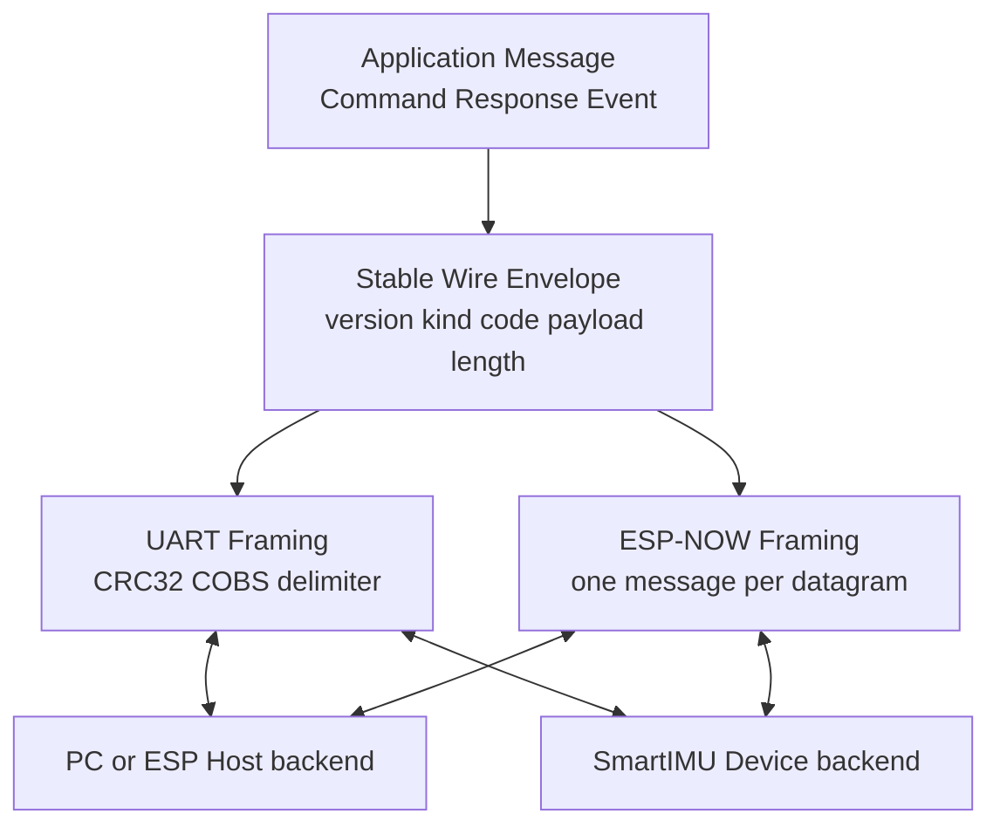

# SmartIMU 通信协议计划

> 状态：Draft
>
> 本文单独规划 Host 与 SmartIMU Device 之间的 application protocol、wire encoding 和 Link framing。系统角色、Actor、Sensor 状态机见 [architecture.md](architecture.md)；Device、Sensor、Sample、Fusion 等领域类型见 [data-model.md](data-model.md)。

## 1. 目标与边界

同一套协议必须同时服务：

- PC Host。
- 另一块 `no_std + alloc` ESP Host。
- 后续手机 Host。
- 5 IMU 开发板和单 IMU 量产设备。

v1 只规划两种 Link：

- UART。
- ESP-NOW。

协议负责：

- Command、Response、Event 的业务语义。
- Request/Response 关联。
- Device、boot session、Sensor 和 Stream 的身份作用域。
- 稳定 wire code、长度检查和兼容规则。
- UART 与 ESP-NOW 的 framing 边界。

协议不负责：

- Actor 和 Sensor 状态机的内部实现。
- SPI/I²C、GPIO 和 IMU register protocol。
- Viewer UI、记录文件格式和回放索引。
- BLE/Wi-Fi 的假想 negotiation。
- v1 通用分片、可靠传输和 Host 身份认证。

## 2. 现有代码审查

现有 `crates/smartimu/src/protocol.rs` 不是全部推翻，而是按职责拆分。

### 2.1 直接复用或保留语义

| 现有内容 | 目标处理 |
|---|---|
| `ProtocolVersion`、`PROTOCOL_VERSION` | 保留版本语义 |
| `ResponseResult<T>` | 保留 `Ok/Err` 结构 |
| `ProtocolErrorCode`、`From<SmartImuError>` | 保留稳定错误分类并调整命名 |
| `SampleReadoutRequest` | v1 保留 temperature 请求；Sensor timestamp 后续 |
| `ImuSelection::One/Many/All` | 改名为 Device-local `SensorSelection` |
| Ping、Inventory、Sensor info、Start/Stop、Sample、Orientation、Error、Heartbeat payload | 保留仍属于 v1 的业务信息 |
| `BinaryEncoder`/`BinaryDecoder` | 保留 postcard、CRC32、COBS、delimiter 和 buffer 复用思路，移入 UART adapter |
| JSON encoder | 仅作为 UART 开发诊断 feature |

### 2.2 不直接复用

| 当前问题 | 目标设计 |
|---|---|
| `HostHeader.seq` 名称含糊 | 改为 `RequestId` |
| Response 没有请求关联字段 | 增加 `in_reply_to: RequestId` |
| `DeviceHeader.seq` 是 Device 全局序号 | 删除；多 Link 不能用全局序号判断丢包 |
| 每层重复 `ProtocolVersion` 和 header | 版本只放 wire envelope，Device 身份放 application context |
| `ImuId` 在多处重复 `SystemId` | Device-scoped payload 只使用 `SensorId` |
| `WireMessage -> DeviceMessage -> typed Response/Event` 层级过深 | 内存模型扁平化为 Command/Response/Event |
| 直接 postcard 序列化 Rust enum variant 顺序 | wire 使用显式稳定数值 code，codec 负责 enum 与 code 映射 |
| UART COBS 被误认为通用协议 | COBS 只属于 UART；ESP-NOW 一条 datagram 承载一条消息 |
| `MAX_BINARY_PACKET_LEN = 1470` 被当成统一上限 | 每个 Link backend 使用独立编译期上限 |
| `DeviceSession` 是全局 seq + 消息工厂 | 不复用为 Actor runtime 或 boot session |
| Power Command/Event 没有硬件采集 backend | 不进入 v1，见第 11 节 |

## 3. 三层协议模型



原则：

1. Application message 不知道 UART 或 ESP-NOW。
2. Wire envelope 不负责流式分帧、重传或无线 API。
3. UART 和 ESP-NOW 共享相同 code 与 payload 语义，但 framing 不相同。
4. PC、ESP 和后续手机 Host 复用同一 Rust application model；只替换平台 I/O backend。

## 4. 身份与顺序作用域

```rust
pub struct DeviceId(pub u64);
pub struct BootSessionId(pub u32);
pub struct SensorId(pub u16);
pub struct RequestId(pub u32);
pub struct StreamId(pub u32);
pub struct SampleIndex(pub u32);
pub struct TimestampUs(pub u64);
```

| 类型 | 生成方 | 作用域 |
|---|---|---|
| `DeviceId` | Device identity policy | 一台 SmartIMU Device 的稳定身份 |
| `BootSessionId` | Device boot | 一次 Device 启动，重启后变化 |
| `SensorId` | Board topology | 一台 Device 内的 Sensor |
| `RequestId` | HostClient | 一次 Command/Response 关联 |
| `StreamId` | Device | 一次成功 StartSampling 生命周期 |
| `SampleIndex` | Device | 一个 Sensor 的一个 Stream 内递增 |
| `TimestampUs` | Device | Device 单调时钟；sample payload 中表示采样时刻 |

不定义 `ResponseId`。Response 使用原请求的 `RequestId`：

```rust
pub struct Response<T> {
    pub context: DeviceMessageContext,
    pub in_reply_to: RequestId,
    pub result: ResponseResult<T>,
}
```

不定义 Device 全局 `MessageSeq`。sample gap 使用 `{ BootSessionId, StreamId, SensorId, SampleIndex }` 检测；Link packet 的排序、重传或去重序号留在具体 Link/peer 内部。

`LinkId` 只存在于 Device runtime，用于把 Response 路由回原 UART session 或 ESP-NOW peer，不进入 wire。

## 5. 稳定 Wire Envelope

### 5.1 显式 code

Rust enum 适合内存建模，但其 serde/postcard variant index 不应直接成为长期协议编号。wire 使用显式 code：

```rust
#[repr(u8)]
pub enum MessageKind {
    Command = 1,
    Response = 2,
    Event = 3,
}

#[repr(u16)]
pub enum CommandCode {
    Ping = 1,
    GetDeviceInfo = 2,
    GetTopology = 3,
    GetSensorInfo = 4,
    ConfigureSensor = 5,
    StartSampling = 6,
    StopSampling = 7,
    ReadSample = 8,
}

#[repr(u16)]
pub enum EventCode {
    RawSample = 1,
    SampleBatch = 2,
    PhysicalSample = 3,
    Orientation = 4,
    SensorStateChanged = 5,
    SignificantMotion = 6,
    AttitudeChanged = 7,
    Error = 8,
    Heartbeat = 9,
}
```

Response 的 `message_code` 使用原 `CommandCode`，这样 Host 在解析 payload 前就知道预期 Response 类型。code 一经发布不复用、不重排；删除功能时保留其编号为空洞。

### 5.2 Envelope header

```rust
pub struct ProtocolVersion {
    pub major: u8,
    pub minor: u8,
}

pub struct WireEnvelopeHeader {
    pub magic: [u8; 4],
    pub version: ProtocolVersion,
    pub kind: MessageKind,
    pub message_code: u16,
    pub payload_len: u16,
}

pub struct CommandPacket<T> {
    pub meta: CommandMeta,
    pub body: T,
}
```

Envelope header 使用固定字段顺序和明确的小端整数编码，不通过 postcard 序列化自身；无 body 的 Command 使用 `CommandPacket<()>`。这样 decoder 可以在任何动态分配和 payload 反序列化之前读取并验证 header。

解码顺序：

```text
validate link frame/datagram length
-> parse fixed envelope header
-> validate magic/version/kind/code/payload_len
-> enforce per-code payload limit
-> decode the typed postcard payload selected by kind + code
```

codec 不直接 postcard 序列化顶层 `CommandBody`/`EventPayload` enum。它先把 variant 映射到稳定 code，再序列化该 code 对应的具体 payload struct。

## 6. Application Command

### 6.1 Selection

Device 级命令不需要伪造 Sensor target。只有真正操作 Sensor 的命令携带选择器：

```rust
pub enum SensorSelection {
    One(SensorId),
    Many(Vec<SensorId>),
    All,
}

pub enum StreamSelection {
    One(StreamId),
    Many(Vec<StreamId>),
    All,
}
```

这比通用 `CommandTarget::Device/One/Many/AllSensors` 更安全：`Ping + Sensor target`、`StopSampling + SensorId` 等非法组合无法构造。

### 6.2 Command model

```rust
pub struct CommandMeta {
    pub request_id: RequestId,
    pub device_id: DeviceId,
}

pub struct PingCommand {
    pub message: String,
}

pub struct GetSensorInfoCommand {
    pub sensors: SensorSelection,
}

pub struct ConfigureSensorCommand {
    pub sensors: SensorSelection,
    pub config: ImuSampleConfig,
}

pub struct StartSamplingCommand {
    pub sensors: SensorSelection,
    pub readout: SampleReadoutRequest,
    pub output: StreamOutput,
}

pub struct StopSamplingCommand {
    pub streams: StreamSelection,
}

pub struct ReadSampleCommand {
    pub sensors: SensorSelection,
    pub readout: SampleReadoutRequest,
}
```

`Ping`、`GetDeviceInfo` 和 `GetTopology` 只有 `CommandMeta`，不携带空 target 或无意义字段。

内存中可以提供方便的 enum：

```rust
pub enum CommandBody {
    Ping(PingCommand),
    GetDeviceInfo,
    GetTopology,
    GetSensorInfo(GetSensorInfoCommand),
    ConfigureSensor(ConfigureSensorCommand),
    StartSampling(StartSamplingCommand),
    StopSampling(StopSamplingCommand),
    ReadSample(ReadSampleCommand),
}

pub struct Command {
    pub meta: CommandMeta,
    pub body: CommandBody,
}
```

这个 enum 是 Rust API，不直接决定 wire 编号。

### 6.3 v1 Command 范围

| Command | Response | 说明 |
|---|---|---|
| `Ping` | `PongPayload` | 链路与请求关联检查 |
| `GetDeviceInfo` | `DeviceIdentity` | Device/firmware/protocol 身份 |
| `GetTopology` | `DeviceTopology` | buses、sensors 和静态绑定 |
| `GetSensorInfo` | `Vec<SensorInfo>` | identity、chip profile、生命周期和生效配置 |
| `ConfigureSensor` | `Vec<ConfiguredSensor>` | 配置一个或多个 Sensor |
| `StartSampling` | `Vec<StreamDescriptor>` | 成功后才分配并返回 Stream |
| `StopSampling` | `Vec<StreamId>` | 按 Stream 停止，不按当前 Sensor 状态猜测 |
| `ReadSample` | `Vec<RawSamplePayload>` | 低速诊断/按次读取 |

Calibration、事件规则、health、Sensor reset、固件升级、运行时 Fusion 算法切换和 Power 都不进入 v1。

## 7. Response 与错误

```rust
pub struct DeviceMessageContext {
    pub device_id: DeviceId,
    pub boot_session_id: BootSessionId,
}

pub enum ResponseResult<T> {
    Ok(T),
    Err(ProtocolError),
}

pub struct PongPayload {
    pub message: String,
}

pub struct SensorInfo {
    pub definition: SensorDefinition,
    pub identity: Option<ImuIdentity>,
    pub chip_profile: ImuChipProfile,
    pub lifecycle: SensorLifecycle,
    pub effective_config: Option<ImuSampleConfig>,
}

pub struct ConfiguredSensor {
    pub sensor_id: SensorId,
    pub effective_config: ImuSampleConfig,
}

pub enum ResponsePayload {
    Pong(PongPayload),
    DeviceInfo(DeviceIdentity),
    Topology(DeviceTopology),
    SensorInfo(Vec<SensorInfo>),
    SensorConfigured(Vec<ConfiguredSensor>),
    SamplingStarted(Vec<StreamDescriptor>),
    SamplingStopped(Vec<StreamId>),
    Samples(Vec<RawSamplePayload>),
}

pub type DeviceResponse = Response<ResponsePayload>;
```

`ResponsePayload` 只作为内存 API。wire encoder 根据原 `CommandCode` 校验对应 variant，并只序列化具体 payload；不把 enum variant index 写入 wire。`Many/All` 操作在 v1 采用 all-or-error：执行前先验证所有目标，失败时不产生部分成功 Response。以后确实需要部分成功时再引入逐 Sensor result，不提前增加嵌套结果类型。

错误码：

```rust
#[repr(u16)]
pub enum ProtocolErrorCode {
    CommunicationError = 1,
    ChipNotFound = 2,
    SensorNotFound = 3,
    ConfigError = 4,
    DataNotReady = 5,
    MissingResource = 6,
    UnsupportedConfig = 7,
    UnsupportedCommand = 8,
    InvalidTarget = 9,
    IdentityMismatch = 10,
    MessageTooLarge = 11,
    MalformedMessage = 12,
    VersionMismatch = 13,
    Busy = 14,
    Internal = 255,
}

pub struct ProtocolError {
    pub code: ProtocolErrorCode,
    pub sensor_id: Option<SensorId>,
    pub detail_code: Option<u16>,
    pub diagnostics: Option<String>,
}
```

规则：

- 程序逻辑只依赖稳定 `code`，不解析诊断字符串。
- `diagnostics` 有严格长度上限，不能携带 secret、完整内存或无限日志。
- `SmartImuError` 映射到最接近的稳定协议错误码。
- 未知 Command code 返回 `UnsupportedCommand`；无法安全解析的帧直接丢弃或返回 `MalformedMessage`，取决于是否已得到有效 `RequestId`。
- v1 不建立长任务模型；未来 calibration/升级需要进度和取消时再启用 `OperationId`。

## 8. Event

```rust
pub struct Event<T> {
    pub context: DeviceMessageContext,
    pub payload: T,
}

pub struct HeartbeatPayload {
    pub active_streams: Vec<StreamId>,
}

pub enum EventPayload {
    RawSample(RawSamplePayload),
    SampleBatch(SampleBatch),
    PhysicalSample(PhysicalSamplePayload),
    Orientation(OrientationPayload),
    SensorStateChanged {
        sensor_id: SensorId,
        lifecycle: SensorLifecycle,
    },
    SignificantMotion {
        metadata: SampleMetadata,
    },
    AttitudeChanged {
        metadata: SampleMetadata,
        quaternion: Quaternion,
    },
    Error(ProtocolError),
    Heartbeat(HeartbeatPayload),
}

pub type DeviceEvent = Event<EventPayload>;
```

`EventPayload` enum 同样只作为内存 API；wire 使用 `EventCode` 选择具体 payload。

Event 不设置通用 `sequence/timestamp/source`：

- sample/orientation 使用 `SampleMetadata`。
- sample `timestamp_us` 表示 sample acquisition time，当前来自 ESP 单调时钟，不是 Event 发送时间。
- 智能事件携带触发它的 sample metadata。
- Error/Heartbeat 只携带业务需要的字段。
- sample gap 使用 Stream-local `SampleIndex`；非采样 Event 可靠缺失检测留到出现真实需求后再设计。

## 9. UART 与 ESP-NOW

### 9.1 UART

复用当前 codec 的核心顺序，但把 envelope 也纳入完整性校验：

```text
raw = WireEnvelopeHeader || typed postcard payload
crc = CRC32(raw)
frame = COBS(raw || crc) || 0x00 delimiter
```

```rust
pub enum BinaryCodecError {
    BufferTooSmall,
    Postcard,
    CobsDecode,
    CrcMismatch,
    Truncated,
    InvalidEnvelope,
    UnsupportedVersion,
    UnknownMessageCode,
}

pub struct UartBinaryEncoder {
    raw: Vec<u8>,
    framed: Vec<u8>,
}

pub struct UartBinaryDecoder {
    decoded: Vec<u8>,
}
```

decoder 在任何按 wire 长度扩容前检查 UART 最大 frame 长度和 envelope `payload_len`。

JSON/NDJSON 只作为 UART 开发诊断模式，复用同一 application payload，不形成第二套 Command/Event 定义，也不作为量产兼容承诺。

### 9.2 ESP-NOW

```text
one ESP-NOW datagram = WireEnvelopeHeader || typed postcard payload
```

- 不套 COBS，不加 `0x00` delimiter。
- v1 不做协议分片。
- backend 按实际 ESP-NOW 版本、加密开销和 SDK 限制定义 `MAX_DATAGRAM_LEN`。
- encoded message 超限返回 `MessageTooLarge`。
- 是否增加 application ACK、重传、去重和加密，留到链路可靠性/安全需求确定后。

### 9.3 `SampleBatch`

- v1 一个 batch 只属于一个 `{ SensorId, StreamId }`。
- records 使用 `Vec`，但 encoder 根据目标 Link 上限限制数量。
- UART 和 ESP-NOW 可以使用不同 batch records 上限。
- 不能容纳的低优先级 telemetry 可以延后或丢弃并记录计数，不能阻塞控制 Response。

## 10. HostClient 与 Actor 路由

Host 侧：

```rust
pub struct PendingRequest {
    pub request_id: RequestId,
    pub device_id: DeviceId,
    pub command_code: CommandCode,
    pub deadline_ms: u64,
}

pub struct RemoteSensorState {
    pub sensor_id: SensorId,
    pub lifecycle: SensorLifecycle,
    pub active_stream: Option<StreamDescriptor>,
    pub last_sample_index: Option<SampleIndex>,
}

pub struct RemoteDeviceState {
    pub identity: Option<DeviceIdentity>,
    pub boot_session_id: Option<BootSessionId>,
    pub sensors: Vec<RemoteSensorState>,
}

pub struct HostClient {
    pub next_request_id: RequestId,
    pub pending: Vec<PendingRequest>,
    pub devices: Vec<RemoteDeviceState>,
}
```

- Response 只通过 `in_reply_to` 匹配 pending request。
- Event 交错不能完成或取消 pending request。
- HostClient 只保存控制状态和最新 sample index，不保存无限图表历史。
- pending/device/sensor 数量在插入前执行运行时上限检查。

Device 侧：

```text
Link backend receives bytes/datagram
-> decode Command
-> ActorMessage::HostCommand { link_id, command }
-> SmartImuActor handles command
-> ActorOutput::Reply { same link_id, response }
-> Link Manager sends response to original endpoint
```

`LinkId` 是 out-of-band runtime route，不写入 Command/Response。Publish Event 由 Link Manager 按订阅或 v1 默认策略分发。

## 11. Power 数据模型审查

### 11.1 当前结论

现有代码定义了 `PowerSource`、`BatteryStatus`、`PowerStatus`、`LowPowerSeverity` 以及 `GetPowerStatus`/Power Event，但当前 `docs/hardware.md` 没有描述：

- 电池。
- 充电管理芯片。
- 电量计或 ADC 电压采样。
- USB/VBUS 检测。
- 低电量阈值和事件来源。

现有使用点主要是协议消息工厂和 Viewer 展示，没有真实 power telemetry backend。因此这些类型是提前设计出来的协议表面，不进入目标 v1。

### 11.2 现有结构的问题

- `PowerSource` 名称像“当前有效供电源”，但 `battery: Some(...)` 与 `source: Usb` 可以同时成立，语义没有写清。
- `Unknown` 和多个 `Option` 重复表达未知/不可用，可能产生 `PowerStatus { source: Unknown, battery: Some(all fields None) }` 之类无意义状态。
- `NotCharging` 与 `Discharging` 边界不清；外部供电存在但充电器 idle 时属于哪一种没有定义。
- `percentage` 不是所有板都能可靠估算，不能仅根据电压通用换算。
- `temperature_deci_c` 只有存在电池温度传感器时才有来源。
- `LowPowerSeverity` 属于阈值/告警策略，不属于原始 power status；当前也没有阈值定义。

### 11.3 后续有真实硬件时的最小草案

```rust
pub enum ActivePowerSource { // [后续]
    Battery,
    Usb,
    External,
}

pub enum BatteryChargeState { // [后续]
    Idle,
    Charging,
    Discharging,
    Full,
}

pub struct BatteryStatus { // [后续]
    pub voltage_mv: u16,
    pub percentage: Option<u8>,
    pub temperature_deci_c: Option<i16>,
    pub charge_state: Option<BatteryChargeState>,
}

pub struct PowerStatus { // [后续]
    pub active_source: Option<ActivePowerSource>,
    pub battery: Option<BatteryStatus>,
}
```

设计含义：

- `active_source` 只表示当前主要供电路径；未知或硬件不可检测时使用 `None`，不再增加 `Unknown` variant。
- `battery: Some` 表示设备确实能提供至少电池电压；即使当前由 USB 供电也可同时存在。
- percentage、temperature 和 charge state 只有硬件能可靠提供时才为 `Some`。
- 低电量 Event 与阈值配置在实现真实 power monitor 后单独设计；暂不保留 `LowPowerSeverity`。

引入条件：Board profile 明确 power telemetry source，并至少有一个平台 backend 和 host test。届时再分配 `GetPowerStatus` CommandCode、Power EventCode 和 golden vectors。

## 12. 兼容性规则

- `ProtocolVersion.major`：不兼容的 envelope、字段布局或语义变化。
- `ProtocolVersion.minor`：保留已有 code/payload 布局的新增 Command/Event code。
- 现有 payload struct 在同一协议版本内不随意追加字段；postcard 不是自描述格式，字段变化通常需要新 code 或版本。
- 未知 Event code 可以按 `payload_len` 安全跳过并计数。
- 未知 Command code 返回 `UnsupportedCommand`。
- magic、kind、code、error code 使用固定数值。
- 每个已发布 code 保留 UART raw、UART framed 和 ESP-NOW payload golden vectors。
- 所有 String/Vec/packet 在解码分配前有协议上限。

## 13. v1 测试基线

### Application protocol

- 每个 Command 的成功和结构化错误 Response。
- `in_reply_to == request_id`。
- One/Many/All SensorSelection 的合法、重复和未知 SensorId。
- Many/All 的预校验、all-or-error 语义和失败时无部分副作用。
- StopSampling 使用 StreamId，不误停新 Stream。
- Event 与 Response 任意交错。
- boot session 变化后 Host 清理旧 Stream 状态。
- sample index gap 和 wrapping。

### Wire codec

- 每个稳定 code 的 binary golden vector。
- major/minor 兼容判断。
- 未知 code、非法 kind、错误 magic、错误 payload length。
- truncated、CRC failure、COBS failure、postcard failure。
- decoder 在分配前拒绝超长 String/Vec/frame。

### Link

- UART 损坏帧后的 delimiter 重同步。
- ESP-NOW 一 datagram 一 message，超限返回 `MessageTooLarge`。
- 相同 application payload 经 UART/ESP-NOW 解码后语义一致。
- telemetry backpressure 不阻塞控制 Response。

## 14. 从现有代码迁移

建议按可测试的小步迁移：

1. 冻结 v1 `MessageKind`、`CommandCode`、`EventCode` 和错误码数值。
2. 在现有 payload 基础上增加 `RequestId/in_reply_to`，删除 Device 全局 `MessageSeq` 依赖。
3. 引入 envelope codec，停止直接序列化顶层 Rust enum variant index。
4. 将当前 `BinaryEncoder`/`BinaryDecoder` 移入 UART adapter，并把 envelope 纳入 CRC。
5. 增加 ESP-NOW datagram codec，不复用 UART COBS。
6. 将 `DeviceSession` 消息工厂职责迁入 Actor/response builder。
7. 更新 `smartimu-host` pending request 和 Device/Stream 状态归约。
8. 添加 golden vectors 后再声明 protocol v1 稳定。

迁移期间旧协议和目标协议不能共享同一个版本号。若需要短期并存，应使用显式 legacy feature 或不同 wire magic，避免误解析。

## 15. v1 发布前待冻结

以下仍是计划参数，不是已经发布的协议承诺：

1. `magic` 的具体 4 bytes 和固定 header byte layout。
2. `ProtocolVersion` 初始值及 major/minor 兼容矩阵。
3. `CommandCode`、`EventCode`、`ProtocolErrorCode` 的最终数值。
4. 每个 String、Vec、typed payload、UART frame 和 ESP-NOW datagram 的上限。
5. `RequestId` wrap 与同一 HostClient 内重复 ID 的处理。
6. v1 Event 默认广播策略，还是先加入最小显式订阅 Command。
7. Heartbeat 是否进入 v1，以及周期由 Device 固定还是 Host 配置。
8. ESP-NOW 是否需要 application ACK、重传、去重和加密。
9. `SampleBatch` 的 records 编码与 UART/ESP-NOW 各自默认批量大小。
10. all-or-error 多 Sensor 操作的 rollback 能否由 Actor/runtime 确实保证；若不能，应在冻结前改成显式逐 Sensor result。