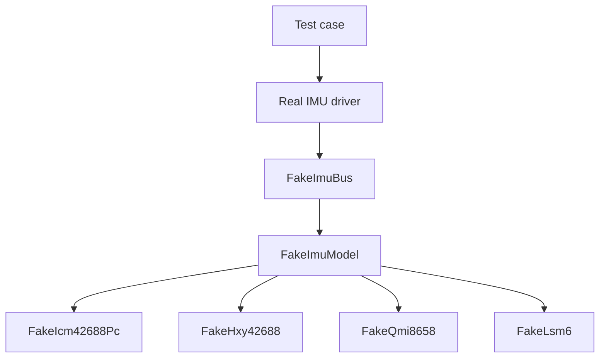

# Testing Strategy

This document describes the preferred testing approach for SmartIMU. It focuses on tests that can protect the IMU initialization flow, fusion algorithm, and host/device protocol without requiring physical hardware for every check.

## Goals

- Verify IMU probe and initialization logic deterministically.
- Protect protocol wire compatibility between firmware and host tools.
- Validate fusion numerical invariants with repeatable inputs.
- Keep most tests runnable on a normal host machine.
- Reserve hardware-in-the-loop tests for electrical, SPI, CS, and end-to-end streaming validation.

## Test layers

| Layer | Purpose | Hardware required |
|---|---|---|
| Unit tests | Pure logic, private helpers, small invariants | No |
| Fake bus / fake IMU tests | Driver probe, configure, sample readout, SPI profile fallback | No |
| Protocol tests | Binary/JSON round-trip, malformed packets, golden compatibility | No |
| Fusion tests | Deterministic algorithm behavior and numerical invariants | No |
| Hardware-in-the-loop tests | Real ESP32-C3, SPI bus, chip-select wiring, streaming | Yes |

## Unit test organization

For module-internal tests, prefer separate `*_tests.rs` files included via `#[path]` rather than large inline test modules.

Example:

```rust
// crates/smartimu/src/protocol.rs

#[cfg(test)]
#[path = "protocol_tests.rs"]
mod tests;
```

```text
crates/smartimu/src/protocol.rs
crates/smartimu/src/protocol_tests.rs
crates/smartimu/src/fusion/mod.rs
crates/smartimu/src/fusion/mod_tests.rs
```

Use integration tests under `crates/*/tests/` for public API behavior and wire compatibility:

```text
crates/smartimu/tests/protocol_binary.rs
crates/smartimu/tests/protocol_json.rs
crates/smartimu/tests/protocol_golden.rs
crates/smartimu/tests/driver_fake_bus.rs
```

## Fake IMU architecture

IMU initialization should be tested with real driver code and fake I/O. Do not mock the driver being tested.

Recommended structure:

```text
Test case
  -> real ImuDriver implementation
  -> FakeImuBus implementing ImuBus
  -> chip-specific FakeImuModel
```



### Generic fake bus

The fake bus should be responsible for bus-level behavior:

- implementing `ImuBus`
- recording `apply_profile`, `read_regs`, and `write_regs` operations
- tracking the current `SpiProfile`
- routing register reads/writes to the active fake chip model
- injecting communication errors when a test needs them

### Chip-specific fake models

Each supported chip should have its own fake model when driver behavior differs materially. A fake model should simulate only the protocol behavior the driver relies on.

Common behavior to model:

- `WHO_AM_I` register address and value
- revision register, if used by the driver
- supported SPI modes/profiles
- initialization register sequence and required order
- reset behavior when relevant
- data-ready status register and mask
- sample register layout
- sample byte order
- read timeout behavior
- communication or config errors for negative tests

Do not build a complete datasheet simulator unless the driver requires that complexity.

### Suggested fake model maturity levels

#### Level 1: register map fake

Use this for the first version of each chip fake.

- fixed register values
- writable register map
- operation recording
- basic sample bytes

This is enough to verify probe, basic configure writes, and sample parsing.

#### Level 2: initialization state machine

Use this when initialization order matters.

- expected write sequence
- wrong register/value/order returns `SmartImuError::ConfigError`
- samples are unavailable until initialization reaches `Ready`

This catches regressions where driver initialization is reordered incorrectly.

#### Level 3: behavioral fake

Use this only for complex chips or regressions.

- reset delays
- register banks/pages
- FIFO behavior
- timestamp behavior
- data-ready changes over simulated time
- ODR/range-dependent scaling

## IMU driver tests

Driver tests should exercise the actual driver implementation through `ImuBus`.

Recommended coverage:

### Probe

- correct `WHO_AM_I` returns detected chip info
- incorrect `WHO_AM_I` returns `None`
- revision match and mismatch cases
- retry behavior when the first read fails or returns the wrong value
- communication errors propagate or are handled according to the layer being tested

### SPI profile fallback

For `probe_driver()` and `probe_first_matching()`:

- first profile fails, second profile succeeds
- all profiles fail returns `Ok(None)`
- `SmartImuError::CommunicationError` during one profile does not stop later profiles
- non-recoverable errors stop probing
- `apply_profile()` calls happen in the expected order

### Configure/init

For each concrete driver:

- expected initialization registers are written
- values match the driver preset
- sequence-sensitive chips reject out-of-order writes in the fake model
- unsupported sample configs return `UnsupportedConfig`
- reset failure prevents configure
- configure failure returns an error

### Sample readout

- data-ready success path
- data-not-ready path
- poll-until-ready path
- read-on-timeout behavior
- big-endian and little-endian sample parsing
- raw accel/gyro axis order matches the driver definition

## Fusion tests

Fusion tests should be pure host-side tests. Feed deterministic accelerometer and gyroscope values directly into `FusionFilter::update_imu()`.

Recommended coverage:

- static upright input keeps quaternion near identity
- `dt_s <= 0.0` does not change state
- output quaternion remains normalized
- constant angular velocity produces the expected approximate rotation after initialization behavior is accounted for
- gyroscope over-range recovery does not produce NaN or an invalid quaternion
- reset restores identity and initialization state

Use explicit tolerances for floating-point assertions. Avoid exact equality except for values that are intentionally unchanged.

Example helper:

```rust
fn assert_close(actual: f32, expected: f32, eps: f32) {
    assert!(
        (actual - expected).abs() <= eps,
        "expected {actual} to be within {eps} of {expected}",
    );
}
```

## Protocol tests

Protocol tests should protect both self-consistency and compatibility.

### Binary round-trip

For each important `WireMessage` variant:

```text
WireMessage -> BinaryEncoder::encode_packet -> BinaryDecoder::decode_packet -> WireMessage
```

Cover at least:

- `PingRequest`
- `InventoryResponse`
- `ProbeDetectedEvent`
- `RawSampleEvent`
- `OrientationEvent`
- `ErrorEvent`
- `HeartbeatEvent`
- `StartSamplingRequest`
- `StopSamplingRequest`

### Malformed packets

Cover:

- empty packet
- delimiter-only packet
- truncated packet
- invalid COBS packet
- CRC mismatch
- packet larger than `MAX_BINARY_PACKET_LEN`

For stable CRC mismatch tests, construct `payload + wrong_crc`, COBS-encode it, and then call `decode_packet()`.

### Golden compatibility tests

Use golden vectors when host/device compatibility matters across releases.

Golden tests should fail when wire layout changes unexpectedly. If a breaking protocol change is intentional, update the golden vector and consider bumping `PROTOCOL_VERSION`.

Recommended golden categories:

- representative binary request
- representative binary response
- representative raw sample event
- representative error event
- JSON message shape when `json` feature is enabled

### JSON tests

When the `json` feature is enabled, test:

```text
WireMessage -> encode_json::<N>() -> decode_json() -> WireMessage
```

Also test too-small buffers.

## Feature-gating considerations

The current crate gates driver-related modules behind the `esp` feature. If host-side fake bus tests become difficult because `esp` pulls in hardware-specific dependencies, split the features so platform-independent driver logic can compile on the host.

Suggested direction:

```toml
[features]
default = []
json = ["dep:serde-json-core"]
drivers = ["dep:async-trait"]
esp = [
  "drivers",
  "dep:embassy-time",
  "dep:embedded-hal",
  "dep:esp-hal",
  "dep:hashbrown",
]
```

Then gate modules approximately as:

```rust
#[cfg(feature = "drivers")]
pub mod driver;

#[cfg(feature = "drivers")]
pub mod drivers;

#[cfg(feature = "drivers")]
pub mod probe;

#[cfg(feature = "drivers")]
pub mod device;

#[cfg(feature = "esp")]
pub mod platform;
```

Delay handling should also be host-testable. Either provide a no-op test delay for host unit tests or introduce a delay abstraction if driver timing behavior needs explicit testing.

## Hardware-in-the-loop tests

Hardware tests should validate behavior that fake tests cannot cover:

- ESP32-C3 boots and initializes peripherals
- SPI SCK/MOSI/MISO pins are wired correctly
- chip-select lines are independent and default high
- each slot responds with the expected identity registers
- supported SPI modes and frequencies work on the real PCB
- initialization succeeds on real sensors
- raw samples stream continuously
- protocol output is decoded by the viewer
- fusion output remains finite during live streaming

Keep hardware tests few and explicit. They should not be required for ordinary host-side development unless the change touches board integration.

The host-side HIL harness lives under `tests/hil`. Its pure validation logic runs as part of `test-host`, while the real board integration test is marked `#[ignore]` and runs only through:

```bash
pixi run just hil
```

The default JSON HIL test auto-detects a unique serial port and observes the board for 10 seconds. Set `ESPFLASH_PORT`, pass a port explicitly (`pixi run just hil COM5`), or change the observation period (`pixi run just hil COM5 20`) when needed. Before running it, flash firmware built from the same working tree; protocol mismatch is treated as a test failure.

The current five-IMU board acceptance requires slot 1, 2, 4, and 5 to report their configured chip models, produce advancing and non-constant raw samples, emit valid orientations, and appear in heartbeat messages. Slot 3 remains disabled and its `ChipNotFound` startup event is allowed. Transient `DataNotReady` events are counted but accepted when the same active IMU continues to meet the sample requirements; communication and configuration errors still fail the test.

See [test-plan.md](test-plan.md) for release-oriented build, flash, viewer, and hardware validation steps.

## Suggested implementation order

1. Add fusion unit tests.
2. Add protocol binary round-trip and malformed packet tests.
3. Add protocol golden tests for important wire messages.
4. Add generic `FakeImuBus` test support.
5. Add one chip fake model, starting with `FakeIcm42688Pc`.
6. Use that as a template for HXY, QMI, LSM6, and other supported chips.
7. Add hardware-in-the-loop notes only after host tests cover the core logic.
